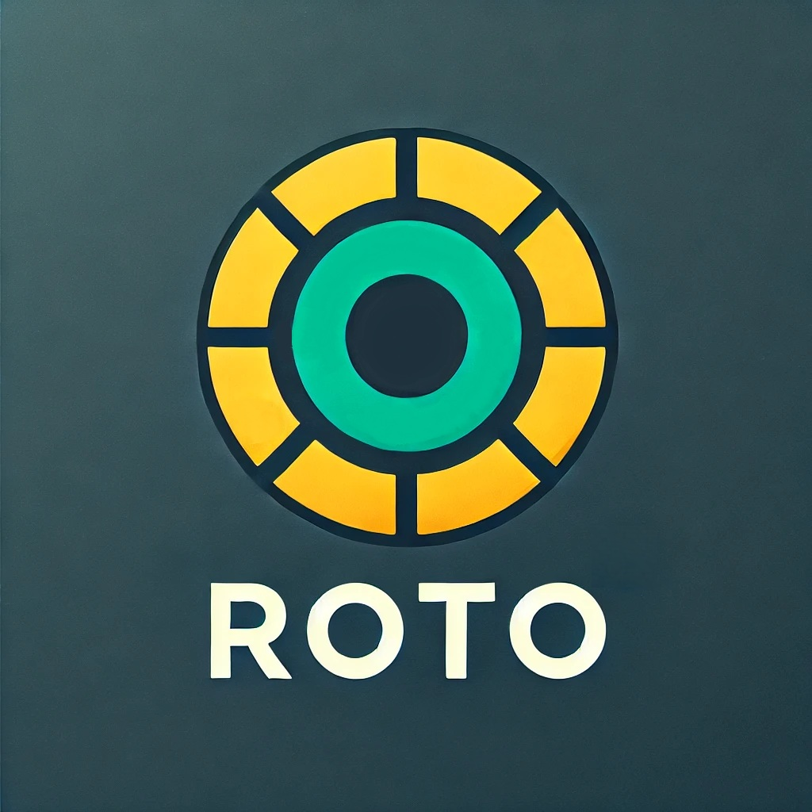
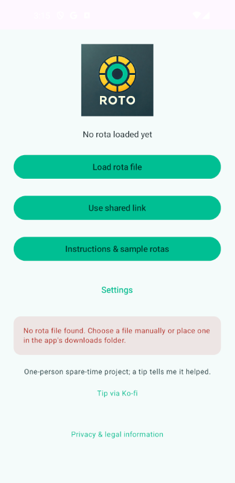
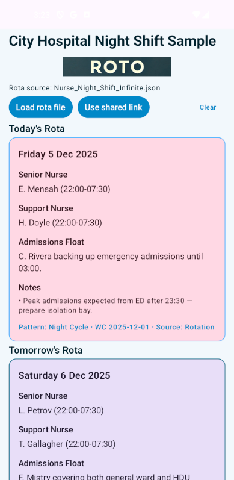
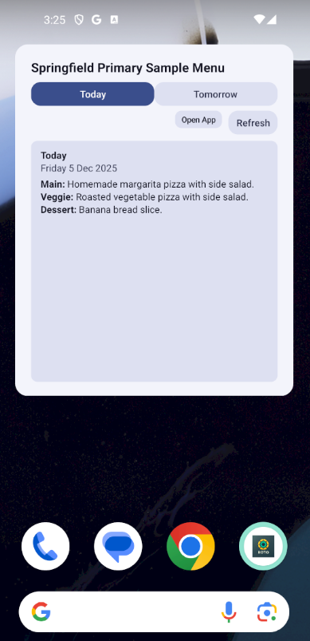

# Roto

<p align="center">
  
</p>

<p align="center">
  
  
  
</p>

Roto is an offline, privacy-first Android app that answers one simple question: **“What’s on the rota tomorrow?”** It keeps any rotating schedule on-device—school dinners, shift work, collections, rehearsals—honouring real calendar Mondays for Week 1/Week 2/Week 3... style cycles, and supports one-off overrides without ever touching the network.

## Key Features

- **Today & tomorrow at a glance** – The home screen surfaces today first, and you can flip to tomorrow with a tap, including notes, tags, and override reasons.
- **Browse any day** – Pick any calendar date (weekends included) to see its slots or a friendly “No rota found” message.
- **Flexible slots** – Schema 0.3 stores labelled slots (Option 1, Grab & Go, Duty, etc.) plus optional tags for allergens or year groups.
- **Looping cycles** – Supply a repeat anchor once and the app keeps the rota cycling forever without duplicating dates.
- **Ready-made samples** – Example rotas ship in `app/src/main/assets/sample_rotas` so you can preview the UI or tweak them for your own needs (school menu, shift cycle, etc.).
- **Offline JSON import** – Load any rota via **Load rota (JSON)** or by placing `RotoRota.json` in the app’s scoped Downloads directory.
- **Shared link rotas** – Paste a GitHub Gist (or other HTTPS) link; the app converts standard gist URLs to their raw JSON endpoints, downloads once, caches locally, and keeps serving the cached copy offline.
- **Recent rotas list** – The setup screen remembers your last 5/10 rotas (local or shared links) so you can reopen them with one tap; clear or change the limit in Settings.
- **AI helper prompt** – The setup screen’s **Copy AI Instructions** button gives anyone a ready-made prompt to turn a PDF/photo into valid JSON with their favourite assistant.
- **Privacy by default** – No analytics, tracking, or proprietary dependencies; the app runs happily offline and is F-Droid friendly. Build is pinned and reproducible-friendly (Gradle SHA pinned; dependency metadata signing block disabled for F-Droid).
- **Custom themes (app + widget)** – Pick from Light/Dark/System plus Forest, Sunset, Ocean, Blossom, Midnight, and Sand. The widget automatically follows your selected theme.

## Getting Started

1. **Install the app on your phone**
   - Side-load the latest APK (release builds live in `app/build/outputs/apk/release`).
   - Or generate your own signed build by following the [build guide](docs/BUILDING.md).
   - F-Droid and Google Play listings are planned; once live you can install directly from those stores. Release APKs are published as `roto-v<version>.apk` (e.g. `roto-v1.0.2.apk`) on GitHub to match F-Droid’s Binaries pattern.
2. **Generate the rota JSON**
   - On the setup screen tap **Copy AI Instructions**.
   - Paste the prompt into your preferred assistant (ChatGPT, Claude, Copilot, etc.) and either have a conversation with the AI or share an existing rota you have, such as a PDF/photo/text so it can build your rota file.
   - The AI will reply with a JSON file matching the roto schema 0.3.
   - You can also, manual edit a json rota file, select a sample rota and edit it `app/src/main/assets/sample_rotas`.
3. **Load the rota file**
   - Save the helper’s reply (for example `RotoRota.json`).
   - In the app tap **Load rota file** and choose it, (There is also a default file name that will be checked for `Android/data/org.roto/files/Download/RotoRota.json` , this can help sharing out a rota file to just work straight away without the need to load it).
4. **Browse the rota**
   - The home screen shows today and tomorrow at a glance.
   - Even though the app focuses on quick today/tomorrow views, you can open **Browse rota weeks** to inspect any upcoming week’s cycle.
5. **Need to start over?** Tap **Clear rota** on the setup screen to forget the file and return to the instructions.

> **Week anchor tip:** Rotating schedules are anchored to real calendar Mondays. Set `cycle.repeat.start_date` to the Monday that should count as “Week 1” and the app will cycle forwards (and backwards) automatically from that date.
>
> If your rota naturally starts mid-week (say, a Wednesday-to-Wednesday shift), anchor it to the nearest Monday and split the data across two weeks so the app can keep the cycle aligned until the any-day anchor feature lands.

## Themes

- Open **Settings → Theme** on the setup screen to switch between System, Light, Dark, Forest, Sunset, Ocean, Blossom, Midnight, and Sand palettes.
- The in-app UI and the homescreen widget both apply the same theme automatically.

## Permissions

Roto only requests one runtime permission:

- `android.permission.INTERNET` – used to download shared-link rotas (for example GitHub Gist raw URLs) and to refresh the homescreen widget. All rota JSON stays on-device and is cached for offline use after the first successful sync.

## JSON Format Summary (Schema 0.3)

Roto’s schema is deliberately lightweight: name the rota, add optional notes, describe one or more week templates (each with an optional repeat anchor), and list per-date overrides for special cases. Each day can contain any number of labelled slots plus tags/notes, letting you model everything from meal choices to shift assignments. For a fully annotated walkthrough, see [`docs/SCHEMA.md`](docs/SCHEMA.md).

```json
{
  "schema_version": "0.3",
  "school_name": "Example Primary School",
  "notes": ["Optional global notes"],
  "special_events": {
    "2025-10-20": "Special Event: World Book Day costumes today"
  },
  "cycle": {
    "repeat": {
      "start_date": "2025-11-03",
      "start_week_id": "Week 1"
    },
    "weeks": [
      {
        "week_id": "Week 1",
        "week_commencing": ["2025-11-03", "2025-11-24"],
        "days": {
          "monday": {
            "slots": [
              { "label": "Option 1", "text": "Chicken Pie" },
              { "label": "Option 2", "text": "Veggie Curry", "tags": ["vegetarian"] },
              { "label": "Grab & Go", "text": "Jacket Potato Bar" }
            ],
            "notes": ["Fruit cup alternative available."]
          },
          "saturday": {
            "slots": [
              { "label": "Weekend Club", "text": "Packed lunch hamper" }
            ]
          }
        }
      }
    ]
  },
  "overrides": {
    "2025-12-19": {
      "closed": true,
      "reason": "Term ends – school closed",
      "notes": ["Wrap lunches available on request."]
    }
  }
}
```

- `week_commencing` entries must be Mondays (ISO `YYYY-MM-DD`).
- Each day contains ordered `slots[]` objects with required `label` and `text`, plus optional `tags[]` and `notes[]`.
- Optional `cycle.repeat` lets the rota loop indefinitely from `start_date`, beginning with `start_week_id` (defaults to the first listed week).
- Use `overrides{}` for one-off closures or special days rather than editing the base cycle.

The full AI helper prompt lives in `app/src/main/assets/ai_llm_instructions.txt`.

## Development

See [`docs/BUILDING.md`](docs/BUILDING.md) for environment prerequisites, debug builds, release signing, and Play/F-Droid packaging. The high-level layout:

- `app/src/main/java/org/roto/data` – Roto models, repository, and DataStore-backed preferences.
- `app/src/main/java/org/roto/domain` – Rotation logic that resolves overrides, notes, and slot lists.
- `app/src/main/java/org/roto/ui` – Compose screens plus the view model that handles imports and date browsing.
- `app/src/main/assets/ai_llm_instructions.txt` – The prompt surfaced by **Copy AI Instructions**.

## Maintenance & Feedback

Roto is a spare-time project. I’m happy to hear bug reports or feature requests, but please understand that I’m one person juggling a full-time job and a family, so updates will be slow and scoped. If you’re comfortable sending pull requests, even small ones, they’re very welcome and help the app improve without waiting on my limited cycles.

## License & Disclaimer

- Source code is licensed under the [Apache License 2.0](LICENSE); forks and contributions are welcome as long as the terms are respected.
- By using the software you agree to the terms in the [DISCLAIMER](DISCLAIMER.md): no warranties, and you remain responsible for verifying rota data before acting on it.
- Third-party libraries (AndroidX Compose, Glance, WorkManager, Kotlinx Serialization, Material Components, etc.) are also Apache 2.0 (or similarly permissive). Attribution details live in [`NOTICE`](NOTICE).

## Contributing

Pull requests and issue reports are welcome. Please keep changes focused and ensure unit tests pass (`./gradlew testDebugUnitTest`) before submitting.
